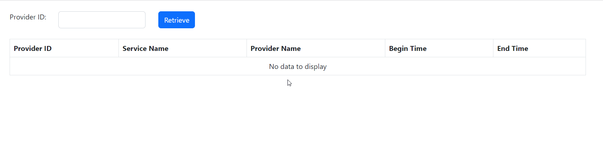

# Interview Task: Make API to retrieve JSON Data and display it in Tabular Format in UI.

API to retrieve ServiceProvider Data from a JSON File based on Provider ID provided by the user and UI displaying the data in a tabular format.

If the provider ID is empty, retrieve all data from json data source else retrieve only the data of specific providerId.
If the provider ID is not numberic, display error message “Invalid Input”.

For API, .NET Core 2.1 is used and Angular 13 is used for the Frontend Code.

## Preview

